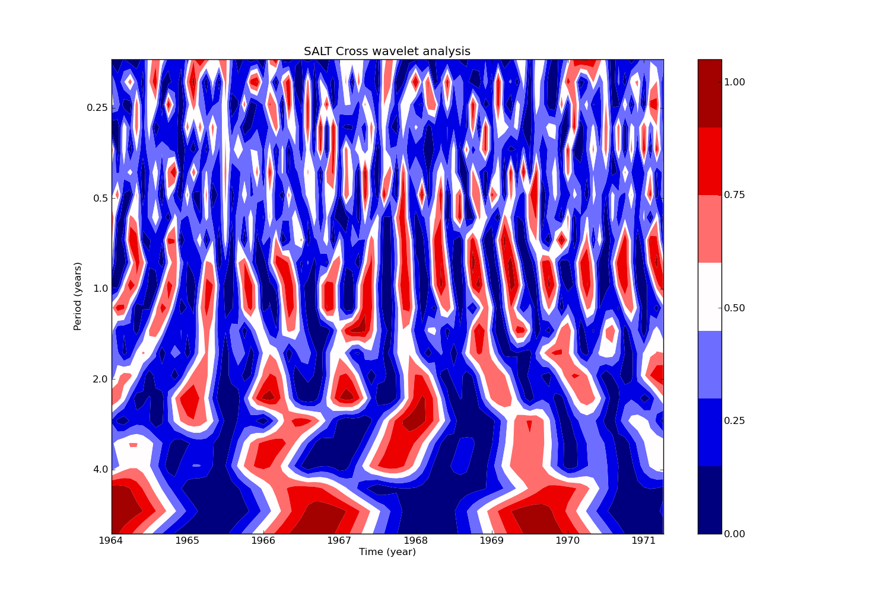

Cross Wavelet Analysis (CWA)
============================

A normalized time and scale resolved measure for the relationship between two time series x(ti) and y(ti) is the wavelet coherency (WCO), which is defined as the amplitude of the WCS(wavelet cross spectrum) normalized to the two single WPS(wavelet power spectrum) (Maraun and Kurths, 2004):

.. math::

	WCO_{i}(s) = \vert WCS_{i}(s)\vert / (WPS_{i}(s) WPS_{i}(s))^{1/2}

