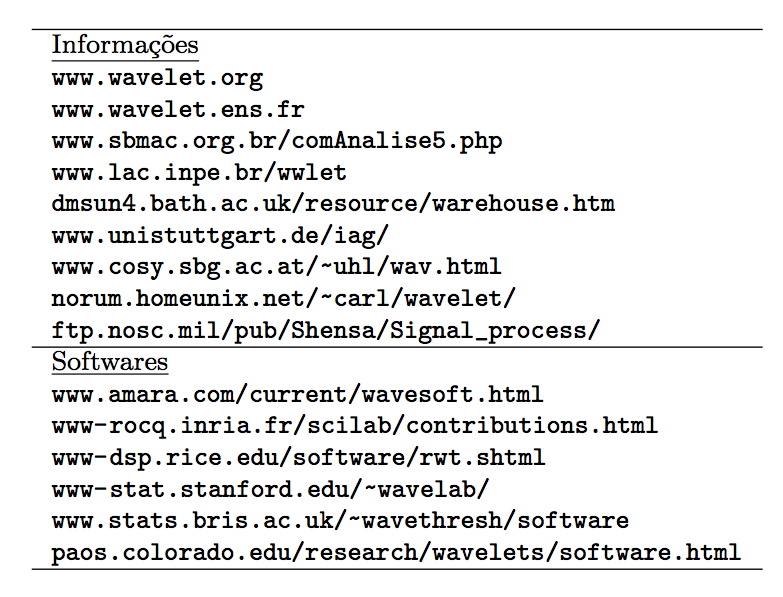

Continuous Wavelet Transform (CWT) Niño3 SST 
===============================================

This is the final result:

 
.. image:: nino_wavelet.png
   :width: 650pt

How can anyone turn a 1D to 2D information?
The code will explain to you!

The code is structed in two scripts:

- lib_wavelet.py : python's functions library

- wavetest.py    : call functions and plot

::

                                 +----------------+
                                 |  wavetest.py   |
                                 +----------------+
					|
                        	+----------------+
                        	| lib_wavelet.py |
                        	+----------------+
                               		|
	              +----------------+  +----------------+
                      |  def wavelet   |--| def wave_signif|            
             	      +----------------+  +----------------+ 
                              |
    	    +----------------+  +----------------+
            | def nextpow2   |--| def wave_bases |
            +----------------+  +----------------+

.. note::
    The Morlet wavelet is used as default in this code.

Building the puzzle ...

Why/when should I use the wavelet analysis
-----------------------------------------------

The wavelet analysis is used for detecting and characterizing its possible singularities, and in particular the continuous wavelet transform is well suited for analyzing the local differentiability of a function (Farge, 1992).

"Therefore the wavelet analysis or synthesis can be performed locally on the signal, as opposed to the Fourier transform which is inherently nonlocal due to the space-filling nature of the trigonometric functions. " (Farge,1992).

                +----------+-----------------+----------------+
                |          |    Fourier      |     Wavelet    |
                +==========+=================+================+
                |context   |    sound        |     image      |
                +----------+-----------------+----------------+ 
                |character |   stationary    |  nonstationary |
                +----------+-----------------+----------------+
                |to see    | global features |  singularities |
                +----------+-----------------+----------------+

Choose the right glasses for what you want to see !               

More info:
----------

Fonte: Domingues (2012)

Papers:
--------

Farge, M. 1992. Wavelet transforms and their applications to turbulence. Annu. Rev. Mech., 24: 395-457

Domingues, M. O.; Kaibar, M.K. 2012. Wavelet biortogonais. Revista brasileira de Ensino de Física,n.3, 34: 3701

  

