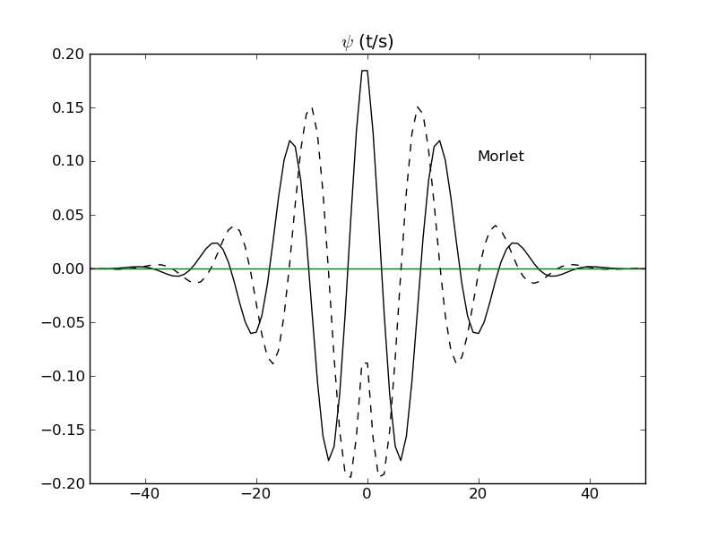

.. Wavelet Analysis documentation master file, created by
   sphinx-quickstart on Mon Mar  4 10:17:32 2013.
   You can adapt this file completely to your liking, but it should at least
   contain the root `toctree` directive.

Waipy's documentation!
======================

Author :  Mabel Calim Costa
email :  mabelcalim@gmail.com

**Contents:**

.. toctree::
   :maxdepth: 3

   intro
   cookbook
   diy
   checkitout
   manual
   example

Indices and tables
==================

* :ref:`genindex`
* :ref:`modindex`
* :ref:`search`

